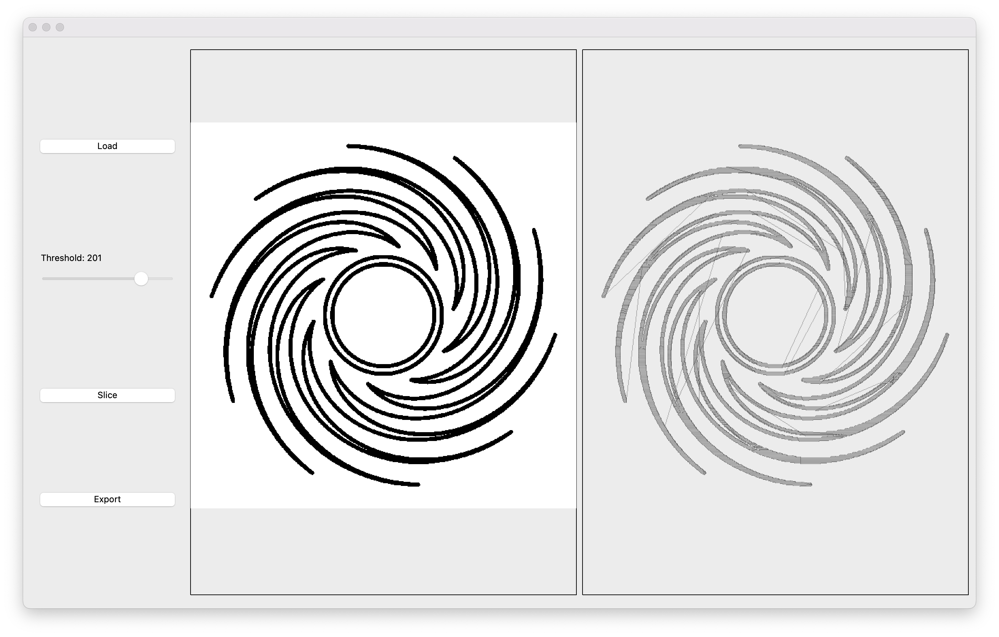

# Painter-Robot

## Overview

**Painter-Robot** is a CNC Pen Plotter project designed to bring your digital images to life on paper. Bresenham's Line Algorithm is used for precise stepper motor control and allows for resource-efficient drawing of straight lines with acceleration. The core logic is written in C++ for the ESP32 microcontroller, with a Python-based slicer for image processing and plotting path optimization. The system features a web interface for manual control and file transfer over the internet.

Additionally, the project includes a **ball sorter accessory**: an add-on that uses a Raspberry Pi and computer vision (OpenCV) to identify the colors of small balls and sort them into baskets automatically.

---

## Features

- **Automated Drawing:** Converts digital images into pen strokes.
- **CNC Precision:** Uses stepper motors for accurate 2D movement.
- **Customizable:** Supports modifications for different pen types and drawing surfaces.
- **Open Source:** Code is open for improvements and customization.
- **Web Interface:** Control the plotter manually and upload instruction files via browser.
- **ESP32 Filesystem Library:** Convenient library for using LittleFS on ESP32.
- **SerialPlotter Integration:** Plot data in real time using [SerialPlotter](https://github.com/SeerBird/SerialPlotter).
- **Python Slicer:** Slicer written in Python with QT framework to convert images into plotter commands.
- **Ball Sorter Accessory:** Optional module using Raspberry Pi and OpenCV to detect ball colors and sort them.

---

## How It Works

1. **Image Processing:** Use the provided Python slicer (QT-based) to convert your image into drawing commands.
2. **Upload Instructions:** Transfer the generated instruction file to the ESP32 via the web interface.
3. **Start Drawing:** The pen plotter follows the instructions, recreating the image on paper.

---

## Assets

### Wirlwind drawing

### Painter Robot 3D Model

### Slicer

### Ball Sorter 3D Model

---

## Contributing

Contributions are welcome! Feel free to open issues or submit pull requests to improve the project.

---

## License

This project is licensed under the MIT License.

---

## Author

[FrosterIlia](https://github.com/FrosterIlia)
